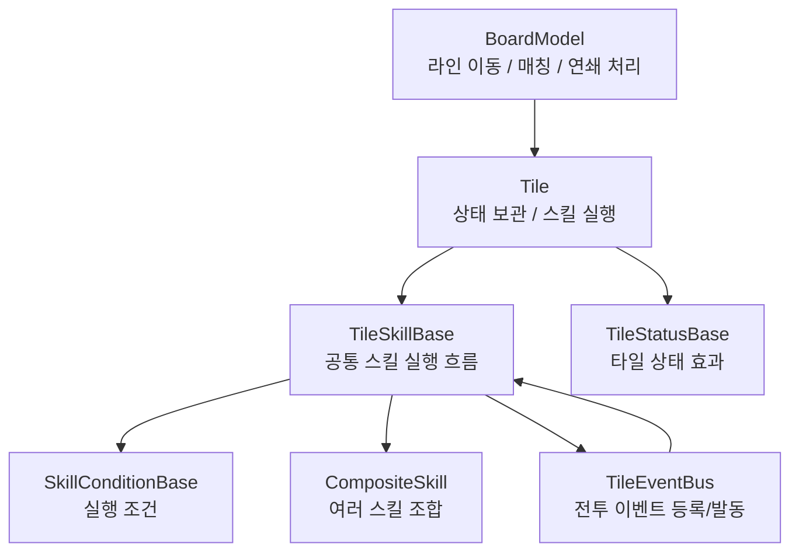

# 별의 아이 (Child Of The Star)

> 5x6 보드의 라인을 밀어 매칭을 만들고, 타일 스킬과 상태 효과가 연쇄적으로 발동되는 2D 턴제 퍼즐 전투 프로젝트입니다.

## 프로젝트 개요

| 항목 | 내용 |
| --- | --- |
| 개발 기간 | 2025.12 - 2026.01 (약 1개월) |
| 사용 엔진 | Unity 6000.3.7f1 |
| 개발 언어 | C# |
| 담당 영역 | 스킬 시스템 전반, 타일 상태/이벤트 구조, BoardModel 일부 구현 및 스킬 연동 |
| 저장소 | https://github.com/Lux3k/ChildOfTheStar |

## 담당 구현 요약

### 1. ScriptableObject 기반 타일 스킬 구조

타일마다 실행할 스킬과 선행 스킬을 `ScriptableObject`로 조합할 수 있게 구성했습니다.

- 타일 데이터는 [`TileSO`](Assets/Scripts/Tile/TileSO.cs)에서 관리
- 스킬 공통 실행 흐름은 [`TileSkillBase`](Assets/Scripts/SKill/TileSkillBase.cs)로 통일
- 조건부 실행은 [`SkillConditionBase`](Assets/Scripts/SKill/Condition/SkillConditionBase.cs)를 통해 분리
- 여러 스킬을 하나의 효과처럼 묶기 위해 [`CompositeSkill`](Assets/Scripts/SKill/CompositeSkill.cs)을 사용

이 구조를 통해 타일 효과를 개별 클래스에 하드코딩하지 않고, 타일 데이터에 스킬 SO를 연결하는 방식으로 확장할 수 있게 했습니다.

### 2. 타일 상태이상 시스템

타일은 광분, 회복, 성장, 재생, 파괴 같은 상태를 가질 수 있으며, 각 상태는 `TileStatusBase`를 상속한 개별 SO로 동작을 정의했습니다.

- 상태 종류와 공통 실행 계약: [`TileStatusBase`](Assets/Scripts/SKill/Status/TileStatusBase.cs)
- 타일별 상태 보관 및 실행: [`Tile`](Assets/Scripts/Tile/Tile.cs)
- 상태 부여/변환/분산 계열 스킬: [`StatusSkill`](Assets/Scripts/SKill/StatusSkill)

상태는 타일 내부의 `Dictionary<TileStatus, List<TileStatusBase>>`에 저장되며, 정해진 순서대로 실행됩니다.  
이를 통해 동일 타일에 여러 상태가 중첩되거나, 특정 상태를 기준으로 다른 스킬이 발동되는 구조를 만들었습니다.

### 3. 이벤트 기반 지속 효과 처리

피해, 회복, 과충전, 턴 종료, 색 변경, 타일 파괴처럼 전투 중 발생하는 사건을 [`TileEventBus`](Assets/Scripts/SKill/EventBus/TileEventBus.cs)에 등록하고 발동하도록 구성했습니다.

이 구조의 목적은 스킬이 특정 시스템을 직접 참조하지 않고도, "어떤 사건이 발생했을 때 실행될 효과"를 등록할 수 있게 하는 것이었습니다.

예를 들어 다음과 같은 흐름을 만들 수 있습니다.

```text
타일 스킬 실행
→ 이벤트 버스에 지속 효과 등록
→ 피해/회복/턴 종료 등 특정 이벤트 발생
→ 등록된 스킬 재실행
```

덕분에 턴 종료 효과, 특정 상태 반응 효과, 과충전 반응 효과처럼 즉시 발동이 아닌 스킬도 같은 실행 구조 안에서 다룰 수 있었습니다.

### 4. 보드 매칭 흐름과 스킬 실행 연동

[`BoardModel`](Assets/Scripts/BoardModel.cs)은 라인 이동, 매칭 판정, 연쇄 처리, 중력, 리필, 과충전 계산을 담당합니다.  
스킬 시스템은 이 보드 흐름에 맞춰 다음 순서로 실행되도록 연동했습니다.

```text
라인 이동
→ 매칭 판정
→ 선행 스킬 실행
→ 상태 효과 실행
→ 타일 기본 스킬 실행
→ 파괴/재생 예약 처리
→ 중력 및 리필
→ 연쇄 매칭 확인
```

보드 로직과 스킬 로직을 완전히 분리하기는 어려운 구조였지만, 스킬 실행 자체는 `Tile`, `TileSkillBase`, `TileEventBus` 쪽으로 모아두어 보드가 모든 효과의 세부 구현을 알 필요는 없도록 했습니다.

### 5. 타일 키워드와 과충전

매칭 상황에 따라 타일에 키워드를 부여하고, 스킬 조건에서 이를 활용할 수 있게 했습니다.

예시 키워드:

- `Rampage`: 4매치 이상
- `Wave`: 같은 색 연속 매치
- `Link`: 2콤보 이상
- `Harmony`: 해당 턴 첫 매치
- `Crack`: 가장자리 매치

또한 특정 색상이 연속해서 매칭될 때 과충전 수치를 누적하고, 과충전 발생 시 관련 이벤트와 UI 갱신이 이어지도록 처리했습니다.

관련 코드:

- 키워드 정의 및 매칭 처리: [`BoardModel`](Assets/Scripts/BoardModel.cs)
- 키워드 보유 여부 확인: [`Tile`](Assets/Scripts/Tile/Tile.cs)
- 과충전 누적 이벤트: [`SkillManager`](Assets/Scripts/Manager/SkillManager.cs)

## 구조 흐름



## 주요 코드 링크

| 구분 | 파일 |
| --- | --- |
| 보드 모델 | [`BoardModel.cs`](Assets/Scripts/BoardModel.cs) |
| 보드 입력/뷰 연동 | [`BoardController.cs`](Assets/Scripts/BoardController.cs) |
| 타일 런타임 객체 | [`Tile.cs`](Assets/Scripts/Tile/Tile.cs) |
| 타일 데이터 | [`TileSO.cs`](Assets/Scripts/Tile/TileSO.cs) |
| 타일 덱/풀링 | [`TileDeck.cs`](Assets/Scripts/Tile/TileDeck.cs) |
| 스킬 베이스 | [`TileSkillBase.cs`](Assets/Scripts/SKill/TileSkillBase.cs) |
| 복합 스킬 | [`CompositeSkill.cs`](Assets/Scripts/SKill/CompositeSkill.cs) |
| 스킬 조건 | [`SkillConditionBase.cs`](Assets/Scripts/SKill/Condition/SkillConditionBase.cs) |
| 이벤트 버스 | [`TileEventBus.cs`](Assets/Scripts/SKill/EventBus/TileEventBus.cs) |
| 타일 상태 | [`TileStatusBase.cs`](Assets/Scripts/SKill/Status/TileStatusBase.cs) |

## 구현하면서 신경 쓴 점

### 스킬 추가 비용 줄이기

새 타일 효과를 추가할 때 기존 실행부를 계속 수정하지 않도록, 스킬을 `TileSkillBase` 단위로 나누고 타일 데이터에서 조합하는 방향을 선택했습니다.

### 조건과 행동 분리

타일 스킬은 "무엇을 하는가"와 "언제 실행되는가"가 자주 달라지는 구조였습니다.  
예를 들어 같은 데미지 효과라도 실행 조건이 다르면 다른 스킬처럼 동작해야 했고, 반대로 같은 조건이 여러 행동에 재사용될 수 있었습니다.

그래서 행동은 `TileSkillBase`, 조건은 `SkillConditionBase`로 나누었습니다.  
이 판단 자체는 유지보수와 재사용성 측면에서 필요했다고 생각합니다.

다만 아쉬운 점은 조합 방식을 수동 `ScriptableObject` 참조로 처리한 부분입니다.  
`TileSO -> SkillSO -> ConditionSO`처럼 참조가 깊어지면서, 효과 하나를 만들기 위해 여러 에셋을 만들고 연결해야 했습니다.  
중복 코드는 줄였지만, 데이터 작성과 수정 비용은 오히려 커졌습니다.

이 경험을 통해 "데이터는 외부 테이블에서 관리하고, 행동은 코드로 구현한 뒤 ID 기반으로 조립하는 방식"이 더 적합하다고 판단하게 되었습니다.  
이후 프로젝트에서는 CSV와 Dictionary 기반 조합 구조를 사용하는 방향으로 개선했습니다.

### 즉시 효과와 지속 효과를 같은 틀에서 다루기

즉시 실행되는 스킬뿐 아니라 "턴 종료 시", "피해를 받을 때", "특정 상태가 발동될 때"처럼 나중에 실행되는 효과도 필요했습니다.  
이를 위해 이벤트 버스를 두고, 지속 효과는 이벤트에 스킬을 등록한 뒤 해당 사건이 발생했을 때 다시 실행되게 했습니다.

### 상태 효과의 확장성

상태 효과를 타일 클래스 안에서 분기 처리하지 않고 `TileStatusBase` 파생 클래스로 분리했습니다.  
상태가 늘어나도 타일은 상태 목록을 보관하고 실행 순서를 관리하는 역할에 집중하도록 했습니다.

## 아쉬운 점과 개선 방향

- `BoardModel`이 매칭, 연쇄, 과충전, 키워드, 보드 리필 흐름을 많이 가지고 있어 클래스 책임이 커졌습니다.
- 스킬/상태 SO가 늘어날수록 수동 참조 비용이 커졌고, 인스펙터에서 조합 오류를 찾기 어려워 데이터 검증 도구가 있으면 좋았을 것 같습니다.
- 이벤트 버스에 등록된 스킬의 생명주기와 발동 순서를 더 명확하게 추적할 수 있는 디버그 UI가 부족했습니다.
- 폴더명(`SKill`)과 일부 주석 인코딩이 정리되지 않아 저장소를 처음 보는 사람이 읽기 불편한 부분이 남아 있습니다.

## 회고

이 프로젝트에서는 "보드에서 발생한 사건이 타일 스킬과 상태 효과로 어떻게 이어지는가"를 중심으로 구현했습니다.  
특히 타일 효과를 개별 코드에 고정하지 않고, 스킬/조건/상태/이벤트를 작은 단위로 나누어 조합하려고 했습니다.

완성도 면에서는 데이터 검증과 디버깅 도구가 부족했고, 수동 SO 참조 방식의 작성 비용도 컸습니다.  
다만 이 경험을 통해 조건/행동 분리의 필요성과 함께, 실제 콘텐츠 제작에서는 외부 테이블 기반 데이터 관리가 왜 중요한지 체감할 수 있었습니다.
